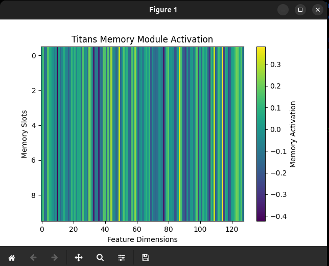

# Titans: Learning to Memorize at Test Time

[](Titans.png)

Welcome to **Titans**, a PyTorch implementation inspired by the public domain paper [*Titans: Learning to Memorize at Test Time*](https://arxiv.org/abs/2501.00663v1). This repository contains a simplified model that demonstrates how to augment neural networks with a long-term memory module.

## Overview

**Titans** explores a novel long-term memory module that:
- **Learns at test time:** Updates its memory based on a "surprise" metric derived from the input.
- **Integrates with Attention:** Uses the learned memory as key/value pairs for a multi-head attention module.
- **Visualizes Memory Activations:** Provides insights into the internal memory dynamics via output heatmaps.

The repository includes:
- **`titans.py`**: A standalone Python script that runs the model and visualizes memory activations.
- **`titans_notebook.ipynb`**: An interactive Jupyter Notebook version for experimentation and further exploration.
- **`Titans_ArXiv_2501.00663v1.pdf`**: The public domain paper on arXiv that inspired this work.
- **`Titans.png`**: A sample output image showing the memory module activation.

## Installation

Make sure you have Python 3.11+ installed. Then, install the required packages using pip:

```bash
pip install torch torchvision torchaudio matplotlib notebook

